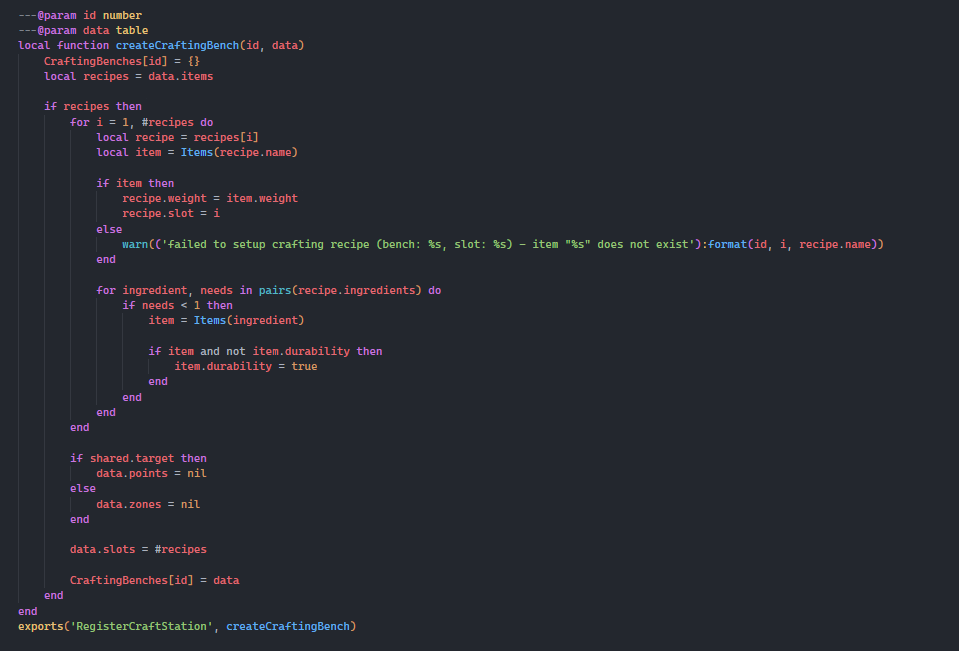

# 🛠 Ox Inventory Changes

Step 1

Head over to ox\_inventory/client.lua and search for this around line 175

```lua
'ox_inventory:openCraftingBench'
```

Now replace this

```lua
left = lib.callback.await('ox_inventory:openCraftingBench', 200, data.id, data.index)

if left then
	right = CraftingBenches[data.id]

	if not right?.items then return end

	local coords, distance

	if not right.zones and not right.points then
		coords = GetEntityCoords(cache.ped)
		distance = 2
	else
		coords = shared.target == 'ox_target' and right.zones and right.zones[data.index].coords or right.points and right.points[data.index]
		distance = coords and shared.target == 'ox_target' and right.zones[data.index].distance or 2
	end

	right = {
		type = 'crafting',
		id = data.id,
		label = right.label or locale('crafting_bench'),
		index = data.index,
		slots = right.slots,
		items = right.items,
		coords = coords,
		distance = distance
	}
end
```

with this

```lua
left, right = lib.callback.await('ox_inventory:openCraftingBench', 200, data.id, data.index)

if left and right then
	if not right?.items then return end

	local coords, distance

	if not right.zones and not right.points then
		coords = GetEntityCoords(cache.ped)
		distance = 2
	else
		coords = shared.target == 'ox_target' and right.zones and right.zones[data.index].coords or right.points and right.points[data.index]
		distance = coords and shared.target == 'ox_target' and right.zones[data.index].distance or 2
	end

	right = {
		type = 'crafting',
		id = data.id,
		label = right.label or locale('crafting_bench'),
		index = data.index,
		slots = right.slots,
		items = right.items,
		coords = coords,
		distance = distance
	}
end
```

### &#x20;Step 2

Remain in ox\_inventory/client.lua and search for the following around line 1630

```lua
'ox_inventory:startCrafting'
```

Here you want to replace this\


```lua
lib.callback.register('ox_inventory:startCrafting', function(id, recipe)
	recipe = CraftingBenches[id].items[recipe]

	return lib.progressCircle({
		label = locale('crafting_item', recipe.metadata?.label or Items[recipe.name].label),
		duration = recipe.duration or 3000,
		canCancel = true,
		disable = {
			move = true,
			combat = true,
		},
		anim = {
			dict = 'anim@amb@clubhouse@tutorial@bkr_tut_ig3@',
			clip = 'machinic_loop_mechandplayer',
		}
	})
end)
```

With this.

```lua
lib.callback.register('ox_inventory:startCrafting', function(recipe)
	return lib.progressCircle({
		label = locale('crafting_item', recipe.metadata?.label or Items[recipe.name].label),
		duration = recipe.duration or 3000,
		canCancel = true,
		disable = {
			move = true,
			combat = true,
		},
		anim = {
			dict = 'anim@amb@clubhouse@tutorial@bkr_tut_ig3@',
			clip = 'machinic_loop_mechandplayer',
		}
	})
end)
```

### Step 3

Now head over to ox\_inventory/modules/crafting/server.lua

Here you want to put the following under createCraftingBench function

```lua
exports('RegisterCraftStation', createCraftingBench)
```

&#x20;It should look like this\


<figure><figcaption></figcaption></figure>

### Step 4

Within the same file (modules/crafting/server.lua) find the following event\


```lua
lib.callback.register('ox_inventory:openCraftingBench', function(source, id, index)
	local left, bench = Inventory(source), CraftingBenches[id]

	if not left then return end

	if bench then
		local groups = bench.groups
		local coords = getCraftingCoords(source, bench, index)

		if not coords then return end

		if groups and not server.hasGroup(left, groups) then return end
		if #(GetEntityCoords(GetPlayerPed(source)) - coords) > 10 then return end

		if left.open and left.open ~= source then
			local inv = Inventory(left.open) --[[@as OxInventory]]

			-- Why would the player inventory open with an invalid target? Can't repro but whatever.
			if inv?.player then
				inv:closeInventory()
			end
		end

		left:openInventory(left)
	end

	return { label = left.label, type = left.type, slots = left.slots, weight = left.weight, maxWeight = left.maxWeight }
end)
```

and replace it with the following

```lua
lib.callback.register('ox_inventory:openCraftingBench', function(source, id, index)
	local left, bench = Inventory(source), CraftingBenches[id]

	if not left then return end

	if bench then
		local groups = bench.groups
		local coords = getCraftingCoords(source, bench, index)

		if not coords then return end

		if groups and not server.hasGroup(left, groups) then return end
		if #(GetEntityCoords(GetPlayerPed(source)) - coords) > 10 then return end

		if left.open and left.open ~= source then
			local inv = Inventory(left.open) --[[@as OxInventory]]

			-- Why would the player inventory open with an invalid target? Can't repro but whatever.
			if inv?.player then
				inv:closeInventory()
			end
		end

		left:openInventory(left)
	end

	return { label = left.label, type = left.type, slots = left.slots, weight = left.weight, maxWeight = left.maxWeight }, bench
end)
```

### Step 5

In the same file (modules/crafting/server.lua) find the following event

```lua
local success = lib.callback.await('ox_inventory:startCrafting', source, id, recipeId)
```

replace this with the following

```lua
local success = lib.callback.await('ox_inventory:startCrafting', source, recipe)
```

and that is it, you have now completed the inventory changes!
