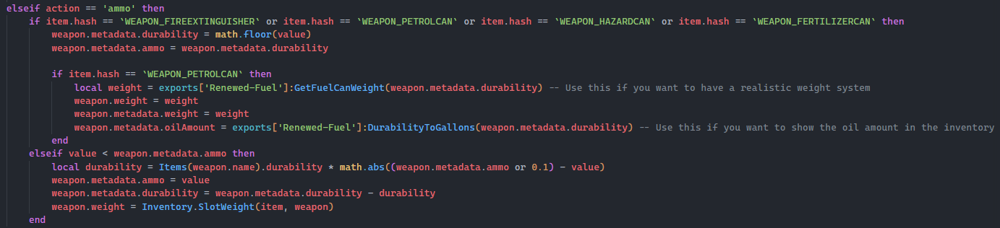

# 📃 Ox Inventory Edits

1. Open ox\_inventory and find the folder called "data" now open that and find "weapons.lua"
2. Once you've opened weapons.lua you can see EVERY single weapon in your server, now find "WEAPON\_PETROLCAN" and change its weight to 0 instead of 12000
3. After that you can headover to modules/inventory/server.lua and find the function called `updateWeapon`
4. Now find the following elseif statement as shown in the picture below

<figure><figcaption><p>Look for this if statement make sure it's the right one where you can see item.hash == `WEAPON_PETROLCAN`</p></figcaption></figure>

5. Now add the following code to the if statement\


```lua
if item.hash == `WEAPON_PETROLCAN` then
	local weight = exports['Renewed-Fuel']:GetFuelCanWeight(weapon.metadata.durability) -- Use this if you want to have a realistic weight system
	weapon.weight = weight
	weapon.metadata.weight = weight
	weapon.metadata.oilAmount = exports['Renewed-Fuel']:DurabilityToGallons(weapon.metadata.durability) -- Use this if you want to show the oil amount in the inventory
end
```

it should end up looking like this

<figure><figcaption></figcaption></figure>

And that is it, now you have realistic fuel can weight and displaying gallons for every petrolcan
